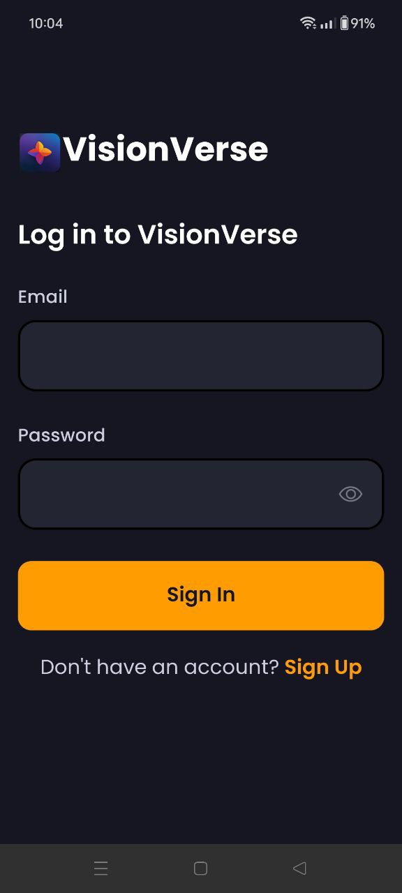

<!-- @format -->

# VisionVerse

VisionVerse is a video sharing app where users upload videos along with AI-generated prompts, allowing seamless playback, pause, and full-screen viewing of the content.
Built with React Native for seamless user experiences, Animatable for captivating animations, and integrated with the dependable backend systems of Appwrite, this app showcases impressive design and functionality, enabling seamless sharing of AI videos within the community.

## ⚙️ Tech Stack

- React Native
- Expo
- Nativewind
- Animatable
- Appwrite

## 🔋 Features

- Onboarding Screen: Welcomes users with clear instructions and engaging graphics.
- Authentication & Authorization System: Keeps user accounts secure with email login.
- Dynamic Home Screen: Smooth animations highlight the latest videos for easy browsing.
- Pull-to-Refresh: Update content with a simple pull gesture for the latest info.
- Full-Text Search: Find videos quickly with real-time suggestions and instant results.
- Tab Navigation: Switch between Home, Search, and Profile sections effortlessly.
- Post Creation: Upload media directly from the app with integrated selection.
- Profile Insights: See account details, uploaded videos, and followers for a personalized experience.
- Responsiveness: Works smoothly on all devices and screen sizes for a consistent experience.
- Animations: Dynamic animations make interacting with the app enjoyable.
- Code Architecture: Built for efficiency and reusability, making development easier.

## 📱 Live Project Link

You can access the live Android APK of VisionVerse on Expo by clicking [here](https://expo.dev/accounts/prashastikarlekar/projects/VisionVerse/builds/9a6b2ad5-277e-436e-98c9-82b8b5862b1c).

## Screenshots

  

  

  
